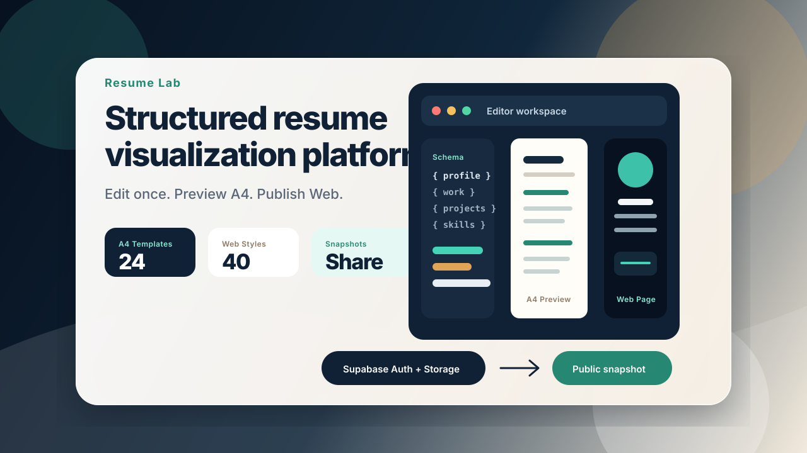
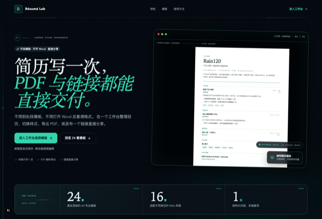
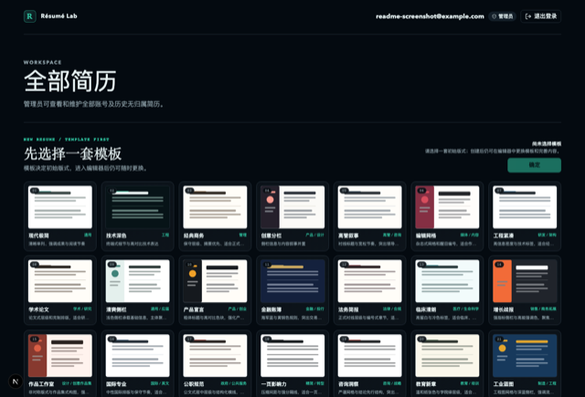
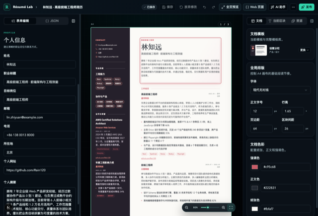
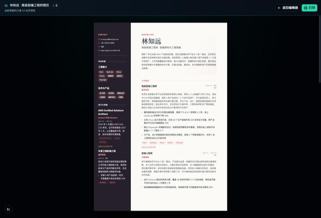
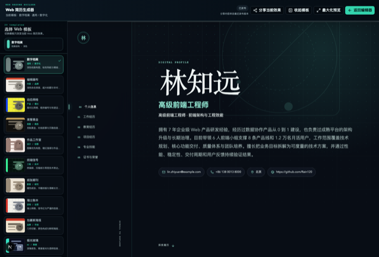
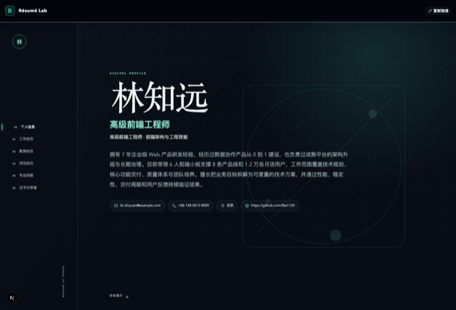

# Résumé Lab

[中文](README.md) | English

<p align="center">
  
</p>

Résumé Lab is a visual platform for resume authoring, A4 layout, and online presentation. It stores resume content as structured JSON so the same career profile can be reused across forms, JSON editing, A4 pages, web pages, and public share links.

The project focuses on real product flows instead of template files alone. Users can choose a template first, maintain content in the workspace, edit structured fields while seeing paginated output, and publish immutable snapshots for public A4 or web access.

The account system supports email/password registration, email confirmation,
sign-in, and password recovery. New accounts must use a common email provider
domain, enforced by both the registration form and a Supabase Auth Hook.

## Pages and Features

The following screenshots are generated from local project pages and stored in `docs/assets/screenshots/`. The table combines page previews and feature descriptions for the main product path from template selection to editing, previewing, web building, and public sharing.

| Page | Preview | Feature Description |
| --- | --- | --- |
| Landing Page |  | The landing page presents the product value, template results, and the full path from content maintenance to multi-channel output. It explains the idea of one content source reused across A4 and web outputs, shows 24 real rendered A4 templates, includes template carousel and workflow comparison, and supports Preview read-only copy, mobile horizontal browsing, and reduced motion preferences. |
| Workspace and Template Library |  | The workspace guides users to choose an A4 template before creating a resume. New users start in the template library, while existing resumes can be filtered by template, publication state, and keyword, with edit, A4 preview, web preview, web share, delete, and batch management actions. Preview accounts remain read-only. |
| Visual Editor |  | The editor places structured forms, JSON input, live A4 pagination, document style controls, section style controls, and asset inspectors in one workspace. It supports form editing, JSON import and export, real-time A4 pagination, image asset management, autosave, undo, redo, optimistic concurrency, AI suggestions, and publishing. |
| A4 Full Preview |  | The A4 full preview helps users inspect the final paginated resume, layout, and print export result. It displays the resume with A4 proportions, supports multi-page review, scaling, returning to the editor, and browser print export, while pagination fills the current page by pixel budget before creating the next page. |
| Web Resume Builder |  | The web resume builder turns the same structured content into an online page and previews responsive results across 40 web styles. It supports progress navigation, scroll targeting, theme motion, responsive layout, empty-content filtering, maximized preview, share-link copying, and returning to the editor. |
| Public Web Share Page |  | The public web share page shows the latest stable snapshot to external visitors without requiring login. A4 share pages are suited for formal applications, web share pages are suited for online viewing and quick review, and draft edits do not automatically change already shared content. |

## Core Modules

| Module | Description |
| --- | --- |
| Structured Schema | `src/shared/resume-schema/` defines the shared data structure for client, server, and JSON editing |
| A4 templates | `src/shared/resume-template/template-schemes.ts` manages 24 A4 template configurations |
| Web templates | `src/shared/resume-template/web-template-schemes.ts` manages 40 web style configurations |
| Editor | `src/features/resume-editor/` owns forms, JSON, style, resources, AI, and save experience |
| Renderer | `src/features/resume-renderer/` owns A4 pagination, public pages, and web resume rendering |
| Workspace | `src/features/workspace/` owns template selection, resume lists, filters, and batch management |
| Authentication | `src/features/auth/` owns common-domain registration, sign-in, email confirmation, and password recovery |
| Domain services | `src/server/domain/` owns ownership checks, administrator access, Preview read-only mode, and publishing |
| Persistence | `src/server/repositories/` and `src/server/assets/` adapt Supabase and test file backends |
| Database | `supabase/platform.sql` is the only initialization script, including tables, indexes, RLS, the Auth Hook, functions, and private Bucket |

## Registration Email Policy

New accounts accept these common email domains:

```text
qq.com
163.com / 126.com / yeah.net
foxmail.com / sina.com / sina.cn / sohu.com / aliyun.com
139.com / 189.cn / wo.cn
gmail.com / outlook.com / hotmail.com / live.com
icloud.com / me.com / yahoo.com / proton.me / protonmail.com
```

This policy applies only to new registrations. Existing-account sign-in,
email-code sign-in, and password recovery remain unrestricted. The form provides
immediate feedback, while `restrict_registration_email_domain` in
`supabase/platform.sql` provides final server-side enforcement.

## How to Develop

Daily development starts with Node.js 20 LTS, pnpm, and an isolated Supabase development project. For first-time setup, execute the Supabase initialization script, copy the environment template, and fill local development values. Development integration and production both use Supabase; the file backend is only for automated and isolated tests.

A practical development flow is to create a sample resume in the workspace, then validate form editing, JSON editing, A4 canvas, and the web builder in the editor. Changes involving Schema, authorization, publishing, assets, or AI should be checked together with the corresponding server-side domain services and tests. Page experience changes should be reviewed on desktop, mobile, reduced motion, and Preview read-only mode.

For exact scripts, environment variables, branch flow, testing strategy, and troubleshooting, see the [Development Guide](docs/development-guide.md). For AI-assisted development, use only the root [AGENTS.md](AGENTS.md) as the Agent rule entry.

## How to Deploy

The project uses Vercel to host the Next.js application, Supabase for Auth, PostgreSQL, and private Storage, and the Vercel Git integration as the deployment entry. Pushing to a linked repository triggers a deployment: `main` builds to Production, other branches and pull requests build Preview Deployments. Build commands come from `vercel.json` in the repository root, and the Node version comes from `engines` in `package.json`.

GitHub Actions provides the quality gate (Biome, TypeScript, Vitest, Playwright) plus the auditable build archive and Release. The two channels have separate responsibilities.

Prepare three environments before deployment: development for local integration, test for Vercel Preview and acceptance, and production for real users. Each environment should use a separate Supabase project. Preview and Production must not share service role keys, databases, or Storage.

Deployment flow:

1. Execute the full `supabase/platform.sql` script in the target Supabase project.
2. Enable the Email Provider and email confirmation in Supabase Auth, then configure the Site URL and `/auth/callback` redirect URL.
3. Enable the Before User Created Hook and bind it to `public.restrict_registration_email_domain`.
4. Import this repository in Vercel with Framework Preset Next.js and the repository root as Root Directory.
5. Configure environment variables for Development, Preview, and Production separately in Vercel Project Settings.
6. Make `quality` and `e2e` required checks in GitHub branch protection so only tested code can be merged.
7. Configure Vercel credentials in GitHub Environments when the versioned archive is required.
8. For production incidents, roll back to a verified Vercel Deployment first, then investigate the root cause.

For full release, rollback, monitoring, and manual deployment procedures, see the [Deployment Guide](docs/deployment-guide.md). For Supabase initialization and security checks, see the [Supabase SQL Guide](supabase/README.md).

## Data and Permission Boundaries

- The browser only establishes sessions through Supabase Auth and does not directly write business tables or private Storage.
- The login UI currently exposes email/password only. The email-code implementation remains in place, but its entry is temporarily hidden.
- Users must accept the Terms of Service and Privacy Policy before login or registration.
- Registration accepts common email provider domains only, then sends a confirmation link. Opening the link establishes a session through `/auth/callback`.
- Password recovery emails a secure link to the registered address. The link establishes a recovery session through `/auth/callback`; after setting a new password, the user returns to the original target page.
- All business writes go through Next.js Route Handlers, where JWT, ownership, administrator permission, and Same-Origin are validated.
- Draft saves write to `resumes.draft_document` and increment the draft version.
- Publishing creates immutable snapshots through the `publish_resume_snapshot` database function.
- Private images are authorized by resume ownership, while public images are readable only when referenced by the latest publication snapshot.
- Preview accounts can only view the fixed sample and cannot save, publish, create, delete, or use AI.
- The global AI provider is enabled only when model name, Base URL, and API key are configured together. Use a rotatable least-privilege key.

## Documentation

| Document | Description |
| --- | --- |
| [README.md](README.md) | Chinese project overview |
| [AGENTS.md](AGENTS.md) | The only AI Coding Agent rule file |
| [docs/development-guide.en.md](docs/development-guide.en.md) / [中文](docs/development-guide.md) | Local development, testing, style, and troubleshooting |
| [docs/deployment-guide.en.md](docs/deployment-guide.en.md) / [中文](docs/deployment-guide.md) | Vercel, Supabase, GitHub Actions, release, and rollback |
| [supabase/README.en.md](supabase/README.en.md) / [中文](supabase/README.md) | Supabase initialization script guide |
| [LICENSE](LICENSE) | Apache License 2.0 |

## License

This project is licensed under the [Apache License 2.0](LICENSE). `private: true` in `package.json` only prevents accidental package publishing and does not affect the repository license.
