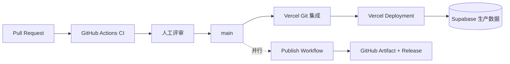

# Résumé Lab 部署手册

[中文](deployment-guide.md) | [English](deployment-guide.en.md)

本文面向负责 Résumé Lab 发布、运维、回滚和生产排障的成员，说明 Vercel、Supabase 与 GitHub Actions 的配置方式和操作边界。

## 阅读方式

- 首次搭建环境：按第 2 至第 4 章完成环境隔离、Vercel、Supabase 和 GitHub 配置。
- 日常发布：重点参考第 5 章和第 11 章。推送即部署，无需手动触发。
- 手动介入：先阅读第 6 章，确认适用场景后再操作。
- 故障处理：优先执行第 8 至第 10 章中的回滚、监控和排查流程。

## 1. 部署目标与原则

项目使用 Vercel 托管 Next.js 应用，使用 Supabase 提供 Auth、PostgreSQL 和私有
Storage。日常部署由 Vercel Git 集成完成，GitHub Actions 负责质量门禁和版本化
发布归档。



两条通道的分工：

| 通道 | 触发 | 职责 |
| --- | --- | --- |
| Vercel Git 集成 | `main` 推送 | 实际构建和部署到 Production |
| Vercel Git 集成 | 分支推送和 PR | 构建 Preview Deployment |
| `.github/workflows/publish.yml` | `main` 推送或手动 | 质量门禁、可审计构建归档和 GitHub Release |

两者都会在 `main` 更新时运行，但只产生两个不同的 Deployment：Git 集成部署负责
线上流量，Publish Workflow 产出的是归档与 Release。若只需要单一部署通道，可以
在 Vercel Project Settings → Git 中关闭自动部署，或在 GitHub 中停用
`publish.yml`；不要让两者都承担线上发布职责。

发布原则：

- 线上生产流量由 Vercel Git 集成产生，便于回滚到任意已验证 Deployment。
- GitHub Actions 必须先通过 `quality` 和 `e2e`，生产分支才允许进入发布流程。
- Preview 和 Production 使用不同 Supabase 项目和不同环境变量。
- 生产故障优先回滚到已验证的稳定 Deployment，再定位根因。

## 2. 环境架构

| 环境 | 应用运行位置 | 数据服务 | 入口 | 用途 |
| --- | --- | --- | --- | --- |
| 开发 | 本机 `next dev` | Supabase Development | `localhost` | 日常开发和调试 |
| 测试 | Vercel Preview | Supabase Test | Preview URL 或测试域名 | 验收和集成验证 |
| 生产 | Vercel Production | Supabase Production | 正式域名 | 真实用户流量 |

硬性隔离要求：

- 三个环境使用不同 Supabase 项目。
- Vercel Preview 和 Production 分别配置环境变量，不共享 service role key。
- 测试环境不得连接生产 PostgreSQL 或 Storage。
- 应用的 `PREVIEW_*` 表示只读体验账号，与 Vercel Preview Environment 不是同一
  概念。

## 3. 构建产物与依赖

### 3.1 运行依赖

| 依赖 | 要求 | 用途 |
| --- | --- | --- |
| Node.js | 22.13 或更高 | 由 `package.json` 的 `engines` 声明下限，Vercel 和 CI 按此选择运行时 |
| pnpm | 使用已提交的 `pnpm-lock.yaml` | 安装依赖并保证构建可复现 |
| Vercel Project | 已创建、已关联 GitHub 仓库 | 托管 Next.js 应用并执行自动部署 |
| Supabase Project | 各环境独立，且已完成 Schema 初始化 | 提供 Auth、PostgreSQL 和私有 Storage |
| Vercel 凭据 | 写入 GitHub Environments | 支持 Publish Workflow 归档通道 |

### 3.2 产物说明

| 产物 | 生成命令 | 用途 |
| --- | --- | --- |
| `.next/` | `pnpm build` | 本地 Next.js 生产运行 |
| Vercel Build | Vercel Git 集成或 `vercel build` | 线上 Deployment |
| `.vercel/output/` | `vercel build` | Vercel Build Output API 预构建产物 |
| `vX.Y.N-vercel-output.tar.gz` | Publish Workflow | 可审计的生产构建归档 |
| GitHub Artifact | Publish Workflow | 保留 30 天的工作流产物 |
| GitHub Release Asset | Production 发布 | 与版本标签长期关联的构建归档 |

生产版本格式为 `v<package-major>.<package-minor>.<github-run-number>`。例如
`package.json` 为 `0.1.0`、GitHub Actions 运行编号为 42，版本是 `v0.1.42`。

Preview 产物使用 `preview-<github-run-number>`，不创建标签和 Release。

不要修改或重新打包已通过验证的 `.vercel/output/` 后再部署。Artifact、
Deployment 和 Release 必须来自同一次工作流运行。

## 4. Vercel 初始配置

### 4.1 创建项目

1. 在 Vercel 创建 Project，并选择 **Connect Git Repository** 关联本仓库。
2. Framework Preset 选择 **Next.js**。
3. Root Directory 保持仓库根目录。
4. Node.js Version 选择 **22.x** 或更高，或交给 `package.json` 的 `engines` 自动决定。
   `pnpm@11.21.0` 需要 Node.js 22.13 以上；低于该版本时 pnpm 无法启动，构建会在安装
   依赖阶段直接失败。
5. Install、Build、Dev 命令由仓库根目录的 `vercel.json` 提供，不需要手填。
6. 在 Settings → Git 中确认 `main` 分支的 Deployment 指向 Production。
7. 在 Settings → Git 中确认其他分支和 PR 生成 Preview Deployment。

`vercel.json` 固定了 `framework`、`installCommand`、`buildCommand` 和
`devCommand`，Vercel 构建行为因此可复现，不依赖 Dashboard 上的隐式默认值。

在本机安装并关联项目：

```bash
pnpm dlx vercel@latest --version
pnpm dlx vercel@latest login
pnpm dlx vercel@latest link
```

`.vercel/project.json` 中可以查看 `orgId` 和 `projectId`。`.vercel/` 是本地生成
目录，不得提交。

### 4.2 配置应用环境变量

在 Vercel Project Settings → Environment Variables 中，为 Development、Preview
和 Production 分别配置：

```dotenv
RESUME_DATA_BACKEND=supabase
SUPABASE_URL=https://environment-project.supabase.co
SUPABASE_SERVICE_ROLE_KEY=environment-service-role-key
# 可选，默认 resume-assets，必须与初始化脚本创建的 Bucket 一致
SUPABASE_STORAGE_BUCKET=resume-assets
NEXT_PUBLIC_SUPABASE_URL=https://environment-project.supabase.co
NEXT_PUBLIC_SUPABASE_PUBLISHABLE_KEY=environment-publishable-key
ADMIN_USER_ID=environment-admin-user-uuid
PREVIEW_USER_ID=environment-preview-user-uuid
PREVIEW_USER_EMAIL=preview@example.com
PREVIEW_RESUME_ID=environment-preview-resume-uuid
PREVIEW_SESSION_SECRET=at-least-32-characters

# 可选：为没有个人配置的用户预填全局 AI Provider
AI_MODEL_NAME=provider-model-name
AI_BASE_URL=https://provider.example.com/v1
AI_API_KEY=provider-api-key
```

环境取值要求：

| Vercel Environment | Supabase 项目 | 说明 |
| --- | --- | --- |
| Development | Supabase Development | 用于 `vercel dev` 或显式拉取开发配置 |
| Preview | Supabase Test | 用于验收、集成验证和临时预览 |
| Production | Supabase Production | 用于真实用户流量 |

变量规则：

| 变量 | 规则 |
| --- | --- |
| `SUPABASE_SERVICE_ROLE_KEY` | 只属于服务端，禁止添加 `NEXT_PUBLIC_` 前缀 |
| `ADMIN_USER_ID` | 必须是对应环境中已确认账号的 Auth UUID |
| `NEXT_PUBLIC_*` | 构建阶段写入客户端产物，变更后必须重新部署 |
| `PREVIEW_*` | 必须同时提供，且 `PREVIEW_SESSION_SECRET` 至少 32 个字符 |
| `AI_*` | 必须三项同时配置才会启用全局默认 Provider |
| `SUPABASE_STORAGE_BUCKET` | 可选，默认 `resume-assets`，必须与初始化脚本创建的 Bucket 一致 |
| `AUTH_TEST_*` | 禁止配置，测试身份只由 Playwright 注入 |
| `RESUME_FILE_*` | 禁止配置，生产环境只允许 `RESUME_DATA_BACKEND=supabase` |

Storage 默认使用初始化脚本创建的私有 `resume-assets` Bucket。全局 AI 配置会通过鉴权接口下发给可编辑用户，必须使用可轮换的最小权限 API Key。

本地 `.env` 不提交到仓库，也不上传到 Vercel。`.vercelignore` 已排除 `.env*`，
只保留 `.env.example` 作为模板参考。

变量来源说明：

| 通道 | 变量来源 |
| --- | --- |
| Vercel Git 自动部署 | 构建时由 Vercel 注入目标 Environment 的配置 |
| Publish Workflow | `vercel pull` 从 Vercel Project Settings 拉取目标 Environment 配置 |
| 本地开发 | `.env`，由 Next.js 自动加载 |

`NEXT_PUBLIC_*` 决定客户端产物内容。修改后必须重新部署，单纯重启 Function 不生效。

如果构建在变量缺失时失败，优先在 Vercel Dashboard → Deployments 的构建日志中
确认缺失的键名，再回到 Project Settings 补齐对应 Environment。不要把真实值
写进 `vercel.json` 或代码。

### 4.3 配置 Supabase

每个 Supabase 环境统一使用完整初始化脚本：

1. 打开 Supabase SQL Editor。
2. 粘贴并执行 `supabase/platform.sql` 的完整内容。
3. 确认脚本执行成功，无未处理错误。

生产变更前先在测试项目验证完整脚本。确认：

- 所有业务表启用 RLS。
- `anon` 和 `authenticated` 没有业务表直连权限。
- `resume-assets` Bucket 是私有 Bucket。
- Bucket 限制为 PNG、JPEG、WebP，单文件不超过 5 MiB。
- `publish_resume_snapshot` 只向 `service_role` 授权。
- `public.announcements` 已创建，且已写入欢迎公告。
- 生产已启用合适的备份和 Point-in-Time Recovery 策略。

`supabase/platform.sql` 是项目唯一的数据库初始化脚本，包含表结构、约束、索引、
RLS、权限、认证 Hook、发布函数和 Storage Bucket。所有环境都执行同一文件。

### 已有环境的增量升级

已初始化的环境需要补齐公告表时，执行 `supabase/update.sql`。该脚本可重复执行，
不会覆盖管理员已修改的公告内容。全新环境不执行它，直接用 `platform.sql`。

建表后若 `/api/announcements` 仍返回 `PGRST205`，说明 PostgREST schema cache
尚未刷新，等待片刻重试即可，不要据此判断建表失败或重复执行建表语句。

在 Supabase Auth 配置：

- 启用 Email Provider，并开启邮箱确认。
- 在 Authentication → Hooks 启用 Before User Created Hook，并选择 Postgres 函数
  `public.restrict_registration_email_domain`。
- 使用常用邮箱验证注册成功，并确认非常用域名在创建用户前被拒绝。
- Production Site URL：正式站点 origin。
- Production Redirect URL：`https://正式域名/auth/callback`。
- Test Site URL：稳定测试域名或当前 Preview origin。
- Test Redirect URL：对应测试站点的 `/auth/callback`。
- 邮箱验证码实现保留 60 秒重发间隔，但登录入口暂时通过样式隐藏；注册通过确认链接完成登录。

对临时 Vercel Preview URL 使用 Supabase 支持的受控通配 Redirect URL，或为测试
环境绑定稳定域名。通配范围必须限制到本项目，不使用全域通配。

### 4.4 配置 GitHub

在 GitHub 仓库 Settings → Environments 创建：

- `preview`
- `production`

在两个 Environment 中配置：

- `VERCEL_TOKEN`
- `VERCEL_ORG_ID`
- `VERCEL_PROJECT_ID`

如果 Preview 和 Production 使用同一个 Vercel Project，`ORG_ID` 和
`PROJECT_ID` 可以相同，但建议仍在两个 Environment 中显式配置。`VERCEL_TOKEN`
应属于专用发布身份，并限制到所需 Scope。

`production` Environment 可额外配置 Required Reviewers。这样手动或自动生产发布
会在部署前等待授权；若要求 `main` 合并后完全无人值守发布，则不要启用该项。

## 5. 自动部署流程

### 5.1 Vercel Git 自动部署

代码推送后的实际行为：

1. 推送非 `main` 分支或创建 PR，Vercel 构建 Preview Deployment。
2. Pull Request 合并到 `main`，Vercel 构建并部署到 Production。
3. Vercel 使用 `vercel.json` 声明的命令和目标 Environment 的变量。
4. 部署完成后在 Dashboard → Deployments 确认状态为 Ready。

该通道不运行 Playwright。合并前必须依赖 GitHub `ci.yml` 的 `quality` 和 `e2e`
通过；若要保证“测试通过才允许上线”，在 GitHub 分支保护中把这两个 Check 设为
必需检查（见第 7 章）。

Vercel 的 Preview 构建会使用 Preview Environment 变量。若 Preview 变量缺失，
构建会在读取 `NEXT_PUBLIC_*` 时失败；此时补齐 Preview 配置并重新部署。

### 5.2 Publish Workflow 归档通道

代码经 Pull Request 合并到 `main` 后，`.github/workflows/publish.yml` 并行运行：

1. `quality` 运行 Biome、TypeScript 和 Vitest。
2. `e2e` 安装 Chromium 并运行 Playwright。
3. 两项全部通过后拉取 Vercel Production 配置。
4. 创建 `.vercel/output/` 和版本化归档。
5. 先上传 GitHub Artifact，再部署同一份预构建产物。
6. 部署成功后创建 Git 标签和 GitHub Release。
7. Deployment URL、环境和版本写入 Job Summary。

这条通道产出的 Deployment 与 Git 集成产出的 Deployment 相互独立。若只保留 Git
集成作为线上发布通道，可以在确认归档需求已满足后停用本工作流，避免同一次
`main` 更新产生两次生产部署。

任何检查、构建、Artifact 上传或部署失败都会阻止后续步骤。Vercel 部署成功但
Release 创建失败时，工作流仍标记失败；Job Summary 保留 Deployment URL，便于
补建 Release 或回滚。

### 5.3 手动触发

1. 打开 GitHub Actions → **Publish**。
2. 选择 **Run workflow**。
3. 选择需要构建的分支。
4. `target` 选择 `preview` 或 `production`。
5. 启动并等待 `quality`、`e2e`、`deploy` 完成。

Production 只允许从 `main` 手动触发。其他分支选择 Production 时，工作流会立即
失败，防止未评审代码绕过分支保护。

## 6. 手动部署

手动部署适用于 GitHub Actions 暂不可用、需要验证 Vercel 构建，或需要重放某次
已验证构建的场景。操作者必须拥有 Vercel Project 权限。

手动部署不会经过 GitHub 分支保护，也不代表代码已通过评审。生产手动部署前必须
确认当前代码已合并到 `main`。

### 6.1 部署前检查

```bash
pnpm install --frozen-lockfile
pnpm check
pnpm test:e2e
pnpm dlx vercel@latest --version
```

生产部署前还应确认：

- 当前代码对应已评审并合并的 `main` 提交。
- 测试环境数据库变更和功能验证已完成。
- Vercel 与 Supabase 生产环境变量完整。
- 已准备数据库备份和兼容的回滚方案。

### 6.2 Preview 部署

```bash
pnpm dlx vercel@latest link
pnpm dlx vercel@latest pull --yes --environment=preview
pnpm dlx vercel@latest build
pnpm dlx vercel@latest deploy --prebuilt
```

命令最后输出 Preview Deployment URL。使用该 URL 完成登录、保存、上传、发布和
匿名分享验收。

### 6.3 Production 部署

```bash
pnpm dlx vercel@latest link
pnpm dlx vercel@latest pull --yes --environment=production
pnpm dlx vercel@latest build --prod
pnpm dlx vercel@latest deploy --prebuilt --prod
```

部署后检查：

```bash
curl --fail --head "https://正式域名/login"
```

随后使用非管理员测试账号验证登录，并验证一条已发布简历的 A4 和 Web 分享页。
不要在生产创建无法清理的大量测试数据。

### 6.4 本地生产启动和停止

本地验证 Next.js 生产构建：

```bash
pnpm install --frozen-lockfile
pnpm build
pnpm start
```

`package.json` 中的 `start` 已固定为 `next start --port 3001`，用于避开开发服务器
占用的 3000 端口。命令行参数优先于 `PORT` 环境变量，因此设置 `PORT` 不会改变实际
监听端口。启动后访问 `http://localhost:3001`。停止进程时在终端按 `Ctrl+C`。

需要使用其他端口时显式追加参数，例如 `pnpm start --port 3100`。

Vercel 是托管运行时，没有 systemd、PM2 或容器级启动/停止命令。Deployment 上传
后自动启动。需要停止故障版本时应回滚到稳定 Deployment；需要紧急阻断流量时，
在 Vercel Dashboard 启用 Deployment Protection 或临时移除生产域名，不应尝试
登录托管实例终止进程。

## 7. 分支保护配置

本项目提供幂等配置脚本：

```bash
GH_TOKEN="$GITHUB_ADMIN_TOKEN" \
  bash scripts/configure-branch-protection.sh "owner/repository" main
```

`GITHUB_ADMIN_TOKEN` 应是具有仓库 Administration 写权限的 fine-grained token。
脚本会配置：

- 必须通过 `quality` 和 `e2e`。
- 必须基于最新 `main` 通过检查。
- 至少一名评审者批准。
- 新提交使旧批准失效。
- 最后一次推送者不能批准自己的推送。
- 必须解决所有 Review Conversation。
- 管理员同样受规则约束。
- 要求线性历史，禁止强推和删除。

首次配置前，先让 `.github/workflows/ci.yml` 至少成功运行一次，便于 GitHub 展示
对应 Check。配置后在 Settings → Branches 或 Rules → Rulesets 中核对规则。

若组织统一使用 Rulesets，可在组织 Ruleset 中配置同等约束，而不重复运行脚本。
不要同时维护互相矛盾的 Branch Protection 和 Ruleset。

## 8. 回滚流程

### 8.1 应用回滚

1. 在 Vercel Dashboard → Deployments 找到最近稳定的 Production Deployment。
2. 记录当前故障 URL、稳定 URL、GitHub Release 和故障时间。
3. 使用 Dashboard 的 Rollback 操作，或执行：

```bash
pnpm dlx vercel@latest rollback "https://stable-deployment-url"
```

4. 确认正式域名已指向稳定 Deployment。
5. 执行登录、简历读取、保存、公开分享和资源读取冒烟检查。
6. 在故障记录中保留原因、影响范围和后续修复任务。

不要通过重新运行旧源码构建代替 Vercel Rollback；重新构建可能解析到不同的工具
版本或环境变量。优先恢复已经验证过的不可变 Deployment。

### 8.2 数据库回滚

应用回滚不会自动回滚 Supabase Schema 或数据。

- 向后兼容迁移优先使用前向修复。
- 删除列、改类型或重写数据前，必须准备并测试逆向 SQL。
- 数据损坏时使用 Supabase Backup/PITR 恢复到独立实例，先核对数据再切换。
- 不在故障现场直接执行未经测试的破坏性 SQL。
- Storage 对象和数据库元数据需要一起检查，避免只恢复一侧。

## 9. 监控和日志

### 9.1 Vercel

Vercel Dashboard 重点查看：

- Deployments：构建日志、部署状态、版本和提交。
- Logs：Function 请求、异常堆栈、状态码和耗时。
- Observability：请求量、错误率、延迟和函数执行。
- Speed Insights/Web Analytics：启用后查看前端性能和访问趋势。
- Usage：函数执行、带宽和配额。

CLI 排查：

```bash
vercel inspect "https://deployment-url"
vercel logs "https://deployment-url"
```

实时生产故障优先在 Dashboard 按 Deployment、时间和 Request ID 过滤，避免在本地
长期保存包含用户数据的完整日志。

### 9.2 Supabase

Supabase Dashboard 重点查看：

- Postgres Logs：SQL 错误、连接和数据库函数异常。
- Auth Logs：登录、邮件、JWT 和 Redirect 问题。
- Storage Logs：私有对象上传和读取失败。
- Reports：数据库容量、连接数、缓存命中和慢查询。
- Advisors：安全、性能和缺失索引建议。

告警至少覆盖：

- Vercel 5xx 错误率和 P95 延迟。
- Function 超时和异常增长。
- Supabase 数据库连接、磁盘和备份失败。
- Auth 错误率异常。
- Storage 容量和请求失败。

日志不得输出 service role key、Vercel Token、完整 JWT、密码、邮箱验证码或完整
简历正文。

## 10. 故障排查

### 10.1 构建失败

1. 在 Vercel Dashboard → Deployments 打开失败记录，定位失败阶段是
   `pnpm install --frozen-lockfile`、`pnpm build` 还是质量检查。
2. 本地使用满足 `engines.node` 的 Node.js 执行相同命令。
3. 检查锁文件是否与 `package.json` 一致，运行 `pnpm install --frozen-lockfile`
   确认没有 lockfile 漂移。
4. 检查 Vercel 目标 Environment 的变量是否完整。Git 自动部署和 Publish
   Workflow 使用不同 Environment 配置，两边都要确认。
5. `NEXT_PUBLIC_*` 缺失时修复配置并重新部署。
6. 不通过跳过测试或移除类型检查来恢复发布。

### 10.2 部署成功但访问 5xx

1. 确认访问的是本次 Production Deployment。
2. 查看 Vercel Function Logs 中的首个服务端异常。
3. 检查 `RESUME_DATA_BACKEND`、Supabase URL、service role 和
   `ADMIN_USER_ID`。
4. 检查 Supabase 服务状态和 Postgres Logs。
5. 若影响用户且无法快速定位，先回滚再分析。

### 10.3 登录或回调失败

1. 比较浏览器 origin、Supabase Site URL 和 Redirect URL。
2. 确认公开 URL 和 publishable key 属于同一 Supabase 项目。
3. 检查账号是否确认、邮件发送是否受限。
4. 检查 Cookie、HTTPS 和浏览器时间。
5. 查看 Supabase Auth Logs 和 Vercel Route Handler 日志。

### 10.4 保存或发布失败

1. 检查 API 状态码和结构化错误码。
2. 确认当前用户是简历所有者或管理员。
3. 检查 `draft_version` 冲突。
4. 检查 `publish_resume_snapshot` 函数及其 service role 权限。
5. 检查 Postgres 锁、慢查询和配额。

### 10.5 图片访问失败

1. 确认默认 `resume-assets` Bucket 存在且保持私有。
2. 检查文件 MIME、大小和数据库元数据。
3. 检查草稿资源的用户归属。
4. 公开页面只允许读取最新发布快照实际引用的资源。
5. 对照 Storage Logs 和应用资源 Route Handler 日志。

## 11. 发布检查清单

发布前：

- Pull Request 已批准，`quality` 和 `e2e` 已通过。
- `supabase/platform.sql` 已在测试环境验证。
- Before User Created Hook 已绑定，常用与非常用邮箱注册结果符合预期。
- Vercel Development、Preview、Production 变量均已复核。
- 无真实密钥进入代码、日志或 Artifact。
- 回滚目标和数据库恢复方式已确认。

发布后：

- GitHub Actions 显示成功。
- Vercel Production Deployment 状态为 Ready。
- Git 集成与 Publish Workflow 两条通道都已完成（或已明确停用其中一条）。
- 正式域名返回成功。
- 登录、保存、上传、发布和匿名分享冒烟检查通过。
- Vercel 和 Supabase 未出现新的错误峰值。
