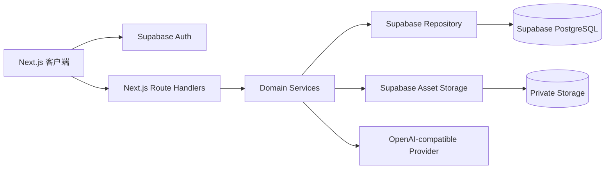

# Résumé Lab 开发共享手册

[中文](development-guide.md) | [English](development-guide.en.md)

本文面向参与 Résumé Lab 开发、测试和代码审查的成员，说明本地环境、工程结构、协作流程、质量门禁和常见排障方式。

## 阅读方式

- 首次接入项目：按第 3 至第 5 章完成依赖、Supabase、环境变量和本地启动。
- 日常开发：重点参考第 5 至第 8 章，覆盖常用命令、分支、提交和代码审查。
- 排查问题：优先查看第 9 章，再结合第 10 至第 12 章确认测试、代码风格和安全基线。
- 部署发布：阅读 [部署手册](deployment-guide.md)，不要在本手册中查找生产发布流程。

## 1. 项目简介与边界

### 1.1 产品能力

Résumé Lab 是基于结构化 JSON 的简历可视化平台，提供表单和 JSON 双模式编辑、
A4 分页预览、Web 简历、模板切换、资源上传、AI 内容建议、带常用邮箱注册限制的认证
和公开分享。

### 1.2 系统边界

系统遵循以下边界：

- 浏览器通过 Supabase Auth 建立会话，但不直接写业务表或私有 Storage。
- Next.js Route Handlers 验证身份并执行用户归属或管理员授权。
- 业务数据和发布快照存储于 Supabase PostgreSQL。
- 简历图片存储于私有 Supabase Storage Bucket。
- 公开分享页只读取最近一次发布生成的不可变快照。
- 全局公告轮播登录后可读，只有管理员可写；公告不含归属用户。

## 2. 技术架构



### 2.1 技术栈

| 分类 | 技术 |
| --- | --- |
| Web 框架 | Next.js 15 App Router、React 19 |
| 开发语言 | TypeScript 5 |
| 样式 | Tailwind CSS 4、项目级 CSS、Radix UI |
| 数据与认证 | Supabase PostgreSQL、Auth、Storage |
| 数据校验 | Zod 4 |
| 单元/集成测试 | Vitest 3、V8 Coverage |
| 端到端测试 | Playwright 1.55、Chromium |
| 代码质量 | Biome 2.2、TypeScript |
| 包管理 | pnpm、`pnpm-lock.yaml` |

### 2.2 目录职责

```text
src/
├── app/                    页面、布局和 Route Handlers
├── components/ui/          基础 UI 组件
├── features/               编辑器、渲染器、模板、认证、公告和工作台
├── lib/supabase/           浏览器/服务端 Supabase 会话辅助
├── server/                 认证、领域服务、仓储、资源和 AI
└── shared/                 跨客户端和服务端共享的 Schema 与设计令牌
                           （含 announcement/ 公告契约）
supabase/
├── platform.sql            唯一数据库初始化 SQL
└── config.toml             Supabase CLI 本地服务配置
tests/e2e/                  Playwright E2E
scripts/                    运维和开发辅助脚本
vercel.json                 Vercel 构建声明，固定 framework 和 install/build/dev 命令
.vercelignore               排除 .env*，保证本地密钥不进入部署包
.nvmrc                      CI 与本地统一的 Node.js 版本，Workflow 通过 node-version-file 读取
```

## 3. 环境依赖

### 3.1 必需依赖

| 依赖 | 要求 | 用途 |
| --- | --- | --- |
| Node.js | 22.13 或更高 | 由 `package.json` 的 `engines` 声明下限，`.nvmrc` 固定 CI 与本地默认版本 |
| pnpm | 11.21.0 | 安装依赖和运行工程脚本，由 `packageManager` 固定 |
| Git 客户端 | 可访问项目仓库 | 拉取代码、创建分支和提交变更 |
| Supabase 项目 | 独立开发项目 | 提供 Auth、PostgreSQL 和私有 Storage |

### 3.2 可选依赖

| 依赖 | 使用场景 |
| --- | --- |
| GitHub CLI | 配置分支保护或维护 GitHub Release |
| Vercel CLI | 本地验证 Vercel Build Output 或手动发布 |
| Supabase CLI 和 Docker | 需要运行 Supabase 本地服务时使用 |

检查本地版本：

```bash
node --version
pnpm --version
```

Node.js 版本由 `.nvmrc` 统一约定，CI 通过 `node-version-file` 读取同一份配置。
`package.json` 的 `engines.node` 声明的是可接受的**下限**，低于该版本的 pnpm 无法启动。

## 4. 本地开发环境搭建

### 4.1 拉取代码

仓库地址为 `https://github.com/chaos-design/nantianmen`，执行：

```bash
git clone https://github.com/chaos-design/nantianmen.git nantianmen
cd nantianmen
```

也可以在 GitHub 仓库的 **Code** 菜单复制 SSH 地址后克隆。

### 4.2 安装依赖

```bash
pnpm install --frozen-lockfile
```

日常开发优先使用 `pnpm install --frozen-lockfile`，确保安装结果与 `pnpm-lock.yaml` 一致。只有明确增删
依赖时才使用 `pnpm add <package>` 并同步更新锁文件。

### 4.3 初始化 Supabase

推荐为开发、测试、生产分别创建 Supabase 项目，不共享数据库或 Storage。

首次初始化开发项目时，在 Supabase SQL Editor 中执行：

```sql
-- 粘贴并执行 supabase/platform.sql 的完整内容
```

`supabase/platform.sql` 是项目唯一的数据库初始化脚本，包含业务表、约束、索引、
RLS、权限收敛、认证 Hook、发布函数和私有 Storage Bucket。项目不维护拆分迁移或种子 SQL。
执行后确认：

- `resumes`、`resume_publications`、`resume_assets`、`announcements` 等表已创建。
- 表已启用 Row Level Security。
- `publish_resume_snapshot` 函数只允许 `service_role` 执行。
- `resume-assets` Bucket 存在且保持私有。
- `announcements` 表已写入一条欢迎公告。

`supabase/config.toml` 已关闭自动迁移和种子加载，因此 `supabase db reset` 不会自动
创建业务表。重建本地环境时，需要重新执行 `supabase/platform.sql` 的完整内容。

已初始化的数据库升级到当前结构时，执行 `supabase/update.sql`。该文件只摘录
`platform.sql` 中与 `public.announcements` 相关的语句，两处内容必须同步修改，
否则数据库结构会出现两个来源。全新环境不需要执行它。建表后接口仍返回
`PGRST205` 属于 PostgREST schema cache 未刷新，等待片刻重试，不要误判为建表失败。

在 Supabase Auth 中完成：

1. 启用 Email Provider。
2. 开启邮箱确认，注册后必须通过确认链接完成登录。
3. 在 Authentication → Hooks 启用 Before User Created Hook，并选择 Postgres 函数
   `public.restrict_registration_email_domain`。
4. 将本地 Site URL 设置为 `http://localhost:3000`。
5. 将 `http://localhost:3000/auth/callback` 加入 Redirect URLs。
6. 创建并确认管理员账号，记录其 User UUID。

登录页当前只展示账号密码方式。邮箱验证码实现仍保留，并维持 60 秒重发间隔，但入口通过
样式暂时隐藏。注册页只收集邮箱和密码，仅允许常用邮箱服务商域名，并通过确认链接建立
登录会话。找回密码会发送恢复链接，链接经 `/auth/callback` 建立恢复会话，用户设置新
密码后返回原目标页面。

允许注册的域名包括 `qq.com`、网易邮箱、Foxmail、新浪、搜狐、阿里云、运营商邮箱，
以及 Gmail、Outlook、Hotmail、iCloud、Yahoo 和 Proton。限制仅作用于新账号注册；
已有账号登录、邮箱验证码登录和找回密码不受影响。前端提供即时提示，
`restrict_registration_email_domain` Hook 负责服务端最终校验。

### 4.4 配置环境变量

复制环境模板：

```bash
cp .env.example .env
```

编辑 `.env`：

```dotenv
RESUME_DATA_BACKEND=supabase

SUPABASE_URL=https://your-project.supabase.co
SUPABASE_SERVICE_ROLE_KEY=your-service-role-key

NEXT_PUBLIC_SUPABASE_URL=https://your-project.supabase.co
NEXT_PUBLIC_SUPABASE_PUBLISHABLE_KEY=your-publishable-key

ADMIN_USER_ID=your-confirmed-admin-user-uuid

PREVIEW_USER_ID=your-preview-user-uuid
PREVIEW_USER_EMAIL=preview@example.com
PREVIEW_RESUME_ID=your-preview-resume-uuid
PREVIEW_SESSION_SECRET=at-least-32-characters

# 可选：为没有个人配置的用户预填全局 AI Provider
AI_MODEL_NAME=provider-model-name
AI_BASE_URL=https://provider.example.com/v1
AI_API_KEY=provider-api-key
```

核心变量：

| 变量 | 是否必填 | 说明 |
| --- | --- | --- |
| `RESUME_DATA_BACKEND` | 是 | 开发联调和生产固定使用 `supabase` |
| `SUPABASE_URL` | 是 | 服务端 Supabase Project URL |
| `SUPABASE_SERVICE_ROLE_KEY` | 是 | 服务端高权限密钥，禁止使用 `NEXT_PUBLIC_` 前缀 |
| `NEXT_PUBLIC_SUPABASE_URL` | 是 | 浏览器可见的 Supabase URL |
| `NEXT_PUBLIC_SUPABASE_PUBLISHABLE_KEY` | 是 | 浏览器可见的 publishable key |
| `ADMIN_USER_ID` | 是 | 已确认管理员账号的 Supabase Auth UUID |
| `SUPABASE_STORAGE_BUCKET` | 否 | 私有 Bucket 名，缺省为 `resume-assets`，与 `supabase/platform.sql` 保持一致 |

`NEXT_PUBLIC_*` 会在 `pnpm build` 阶段写入客户端产物。本地修改后需要重启
`next dev`；Vercel 上修改后需要重新部署。部署侧的 Environment 划分见
[部署手册](deployment-guide.md)。

只读体验账号变量：

| 变量 | 是否必填 | 说明 |
| --- | --- | --- |
| `PREVIEW_USER_ID` | 是 | 只读 Preview 账号 UUID |
| `PREVIEW_USER_EMAIL` | 是 | 只读 Preview 账号邮箱 |
| `PREVIEW_RESUME_ID` | 是 | Preview 展示的简历 UUID |
| `PREVIEW_SESSION_SECRET` | 是 | Preview 会话密钥，至少 32 个字符 |

可选 AI Provider 变量：

| 变量 | 启用条件 | 说明 |
| --- | --- | --- |
| `AI_MODEL_NAME` | 三个 `AI_*` 变量同时配置 | 全局默认 Chat Completions 模型名 |
| `AI_BASE_URL` | 三个 `AI_*` 变量同时配置 | 全局默认 Provider Base URL |
| `AI_API_KEY` | 三个 `AI_*` 变量同时配置 | 全局默认 Provider 密钥，会下发给可编辑用户浏览器 |

配置注意事项：

- 资源存储固定使用私有 `resume-assets` Bucket。
- 三个 `AI_*` 变量全部配置时，没有个人配置的可编辑用户会获得全局默认模型。
- 全局 AI 配置会通过鉴权接口预填到浏览器，因此全局 API Key 对可编辑用户可见。
- 浏览器个人配置优先，并保存在当前用户隔离的 `localStorage` 中。
- Preview 账号不支持 AI。
- 未配置或 Provider 调用失败时，AI API 返回明确错误，不回退到本地模板。
- 自动化测试身份由 `playwright.config.ts` 在测试进程中注入，不写入 `.env`。
- `AUTH_TEST_USER_ID`、`AUTH_TEST_USER_EMAIL` 只允许出现在测试进程。
  生产环境检测到这两个变量会直接抛错拒绝启动。
- `RESUME_FILE_DATABASE_PATH`、`RESUME_FILE_ASSET_DIR` 只用于文件后端，
  生产环境把 `RESUME_DATA_BACKEND` 设为 `file` 会直接抛错。
- `.env` 仅供本地开发。Vercel Development、Preview 和 Production 的变量均在
  Vercel Project Settings 中配置，不从本地文件上传。

### 4.5 启动项目

```bash
pnpm dev
```

访问 `http://localhost:3000`。停止服务时在启动终端按 `Ctrl+C`。

首次启动后至少验证：

1. 可以注册、验证邮箱并登录。
2. 管理员账号可以进入工作台。
3. 可以创建、保存并重新加载简历。
4. 可以上传图片并访问编辑器预览。
5. 发布后 `/r/:slug` 和 `/r/:slug/web` 可以匿名访问。

## 5. 常用命令

| 分类 | 命令 | 说明 |
| --- | --- | --- |
| 开发 | `pnpm dev` | 启动 Turbopack 开发服务器 |
| 构建 | `pnpm build` | 创建 Next.js 生产构建 |
| 构建 | `pnpm start` | 启动已完成构建的生产服务器 |
| 质量 | `pnpm lint` | 使用 Biome 检查格式和规则 |
| 质量 | `pnpm lint:fix` | 自动修复 Biome 可修复问题 |
| 质量 | `pnpm format` | 使用 Biome 格式化 |
| 质量 | `pnpm typecheck` | 执行 TypeScript 类型检查 |
| 测试 | `pnpm test` | 运行全部 Vitest |
| 测试 | `pnpm test:coverage` | 运行测试并检查覆盖率门禁 |
| 测试 | `pnpm test:e2e` | 运行 Playwright Chromium E2E |
| 质量 | `pnpm check` | 依次执行 lint、typecheck 和 Vitest |
| 数据 | `pnpm reset:preview-data` | 重置显式 Preview 账号数据，禁止在生产执行 |

## 6. 分支管理规范

### 6.1 分支角色

- `main`：唯一生产分支，始终保持可发布，不允许直接推送。
- `feature/<issue>-<summary>`：功能开发。
- `fix/<issue>-<summary>`：缺陷修复。
- `docs/<summary>`：纯文档变更。
- `chore/<summary>`：依赖、工具或维护工作。

分支名使用小写英文和连字符，例如
`feature/128-template-search`。分支应保持短生命周期，一个分支只处理一个明确主题。

### 6.2 日常流程

1. 从最新 `main` 创建工作分支。
2. 完成功能、测试和本地质量检查。
3. 推送分支并创建 Pull Request。
4. 等待 `quality` 和 `e2e` 检查通过。
5. 至少获得一名评审者批准并解决全部讨论。
6. 使用 Squash Merge 或 Rebase Merge 保持线性历史。
7. 合并后删除远程功能分支。

禁止向共享分支强推，禁止绕过检查直接合并。

## 7. 提交规范

提交信息采用 Conventional Commits：

```text
<type>(<scope>): <summary>
```

常用类型：

- `feat`：新增用户能力。
- `fix`：修复缺陷。
- `refactor`：不改变外部行为的重构。
- `test`：测试变更。
- `docs`：文档变更。
- `chore`：工具、依赖或维护变更。
- `ci`：CI/CD 变更。

示例：

```text
feat(editor): add template search
fix(auth): preserve callback redirect
docs(deploy): document Vercel rollback
ci(publish): gate production deploy on e2e
```

要求：

- summary 使用祈使语气，准确描述结果。
- 每个提交保持单一目的。
- 破坏性变更在正文中使用 `BREAKING CHANGE:` 说明迁移方式。
- 不提交 `.env`、密钥、测试报告、`.next` 或 `.vercel`。

## 8. 代码审查流程

Pull Request 描述至少包含：

- 背景和目标。
- 主要变更及不在范围内的内容。
- 风险、数据迁移和回滚方式。
- 已执行的检查命令。
- UI 变更的截图或录屏。

作者提交评审前应执行：

```bash
pnpm check
pnpm build
pnpm test:e2e
```

评审者重点检查：

1. 权限、用户归属和公开/私有资源边界。
2. Schema、API envelope 和数据库兼容性。
3. 客户端是否泄露 service role 或其他服务端密钥。
4. 保存、发布和资源操作的错误处理。
5. 测试是否覆盖高风险分支。
6. UI 是否满足键盘操作、可访问性和响应式布局。

作者不得自行批准自己的最后一次推送。所有讨论解决且 Required Checks 通过后才能
合并。

## 9. 开发调试指南

### 9.1 Next.js 页面和 API

- 页面问题先查看浏览器 Console 和 Network。
- Route Handler 问题查看启动终端中的服务端日志。
- 对 API 失败记录请求方法、路径、状态码和响应中的错误码。
- 修改环境变量后重新启动开发服务器。
- 怀疑缓存时确认请求是否显式使用 `no-store`，不要先删除业务数据。

### 9.2 Supabase Auth

登录回调失败时依次检查：

1. `NEXT_PUBLIC_SUPABASE_URL` 和 publishable key 是否属于同一项目。
2. Supabase Site URL 和 Redirect URLs 是否包含当前 origin。
3. 邮箱账号是否已确认。
4. 浏览器 Cookie 是否被域名、HTTPS 或 SameSite 策略阻止。
5. 服务端时间是否准确，避免 JWT 被判定过期。

注册排查：

- 非白名单邮箱显示“请使用 QQ、网易、Gmail、Outlook 等常用邮箱注册”属于预期行为。
- 常用邮箱仍被拒绝时，确认已执行最新 `supabase/platform.sql`，并检查 Before User
  Created Hook 是否绑定 `public.restrict_registration_email_domain`。
- 调整允许域名时，同时更新 `src/features/auth/email-policy.ts` 与 `supabase/platform.sql`，
  避免前端提示与服务端结果不一致。

不要在浏览器代码中使用 `SUPABASE_SERVICE_ROLE_KEY`。

### 9.3 数据库和 Storage

- 在 Supabase Logs 中检查 Postgres、Auth、Storage 请求。
- 确认已执行 `supabase/platform.sql`，并查看 SQL Editor 是否有错误。
- 确认 `resume-assets` 为私有 Bucket。
- 上传失败时检查 MIME 类型、5 MiB 限制、图片尺寸和用户归属。
- 数据读取异常时先确认 `RESUME_DATA_BACKEND=supabase`，不要依赖文件后端回退。

### 9.4 平台公告轮播

- 公告存放在 `announcements` 表，是平台级共享数据，没有归属用户。
- 登录后由 `GET /api/announcements` 下发当前生效的公告，工作台页首渲染轮播。
- 管理员在工作台右上角「公告配置」中增删改，入口仅对管理员渲染。
- 服务端在 `AnnouncementService` 内强制 `isAdmin`，成员和 Preview 都会得到 403，
  不依赖前端隐藏按钮。
- 「停用」对所有人隐藏；用户「关闭」只写入当前浏览器的 `localStorage`。
- 关闭记录带 `updatedAt`，管理员改过内容后公告会重新出现。
- 公告链接只允许站内绝对路径或 `http(s)` 地址，`javascript:` 等协议会被 Schema 和
  数据库约束同时拒绝。
- 调试管理员界面时可用 `PLAYWRIGHT_AS_ADMIN=1 pnpm test:e2e`，该开关只改变注入的
  测试身份，不改变生产鉴权逻辑。

### 9.5 AI 内容建议

- 全局三个 `AI_*` 变量完整时，为没有个人配置的可编辑用户预填默认 Provider。
- 浏览器个人配置优先，仅保存在当前用户的 `localStorage` 中。
- 全局 API Key 会下发到可编辑用户浏览器，只能使用最小权限密钥。
- 共享电脑不应保存高权限 API Key，生产环境必须使用 HTTPS。
- Preview 身份不支持 AI。
- 输出仍须通过 Zod 结构校验，且只有用户确认后才写入草稿。
- 日志中不输出 API Key、完整简历、邮箱或电话。

#### AI 指令（system prompt）

AI 抽屉右上角的图标打开「AI 指令」，展示并编辑完整的 system prompt。

| 事项 | 约定 |
| --- | --- |
| 存储位置 | 仅当前浏览器 `localStorage`，键 `resume-ai:prompts:v3:<userId>` |
| 拼接行为 | 服务端不拼接任何前缀，用户保存什么就发送什么 |
| 内容长度 | 上限 8000 字符，由 `aiPromptGuidanceSchema` 统一约束 |
| 未自定义时 | 不写入本地存储，服务端使用 `defaultAiSystemPrompt` |
| 结构缺失 | 保存前提醒，但不阻止保存 |

「输出结构」那一行是服务端 Zod 校验的硬依赖，删除后模型无法返回可解析结果，
AI 功能会直接报 502。`findMissingStructureMarkers` 负责检测，探针取自该行的字段名。

修改 prompt 文案时注意：结构要求（JSON 字段、unitId 对应、original 逐字复制、
长度上限）不能删，它们不是文案而是契约。`src/shared/resume-ai/resume-ai-prompt-text.test.ts`
会校验默认文案仍然包含这些约束。

### 9.6 Monaco 静态资源

JSON 编辑器通过 `@monaco-editor/react` 加载本地 AMD 资源。仓库路径
`public/monaco/vs` 在运行时对应 `/monaco/vs`，当前只保留 JSON 编辑所需文件：

| 仓库路径 | 用途 |
| --- | --- |
| `public/monaco/vs/loader.js` | AMD 模块加载器 |
| `public/monaco/vs/editor/` | 编辑器核心 JavaScript 和样式 |
| `public/monaco/vs/base/worker/workerMain.js` | 通用编辑器 Worker |
| `public/monaco/vs/base/browser/ui/codicons/codicon/codicon.ttf` | 编辑器图标字体 |
| `public/monaco/vs/language/json/` | JSON 高亮、诊断和格式化 Worker |

这些文件来自当前安装版本的
`node_modules/monaco-editor/min/vs`。需要新增语言、本地化或恢复完整资源时：

1. 先确认 `package.json` 和 `pnpm-lock.yaml` 中的 `monaco-editor` 版本。
2. 从同版本的 `node_modules/monaco-editor/min/vs` 复制对应目录，不混用其他版本。
3. 基础语言资源位于 `vs/basic-languages/<language>`，CSS、HTML、JSON 和 TypeScript
   等语言服务位于 `vs/language/<language>`。
4. 本地化资源位于 `vs/nls.messages.<locale>.js`；复制后还需要同步配置 Monaco
   Loader 的 `vs/nls.availableLanguages`。
5. 修改资源后运行 JSON 编辑器 E2E，确认编辑器加载、诊断、格式化和 Worker 请求
   均正常。

完整发行资源也可以从
[Monaco Editor 官方仓库](https://github.com/microsoft/monaco-editor)或
[npm 包](https://www.npmjs.com/package/monaco-editor)获取，版本必须与项目依赖一致。

### 9.7 常见问题

| 现象 | 排查方法 |
| --- | --- |
| 启动后提示缺少公共 Supabase 配置 | 检查 `.env` 中两个 `NEXT_PUBLIC_SUPABASE_*` 变量并重启 |
| 生产构建提示后端配置非法 | 确认 `RESUME_DATA_BACKEND=supabase` 且服务端变量完整 |
| 生产提示缺少管理员 | 设置有效的 `ADMIN_USER_ID` UUID |
| 登录后反复返回登录页 | 检查 Auth Redirect URL、Cookie 和项目 URL 是否匹配 |
| 保存返回版本冲突 | 重新加载最新草稿，不要覆盖其他会话的新版本 |
| 图片上传失败 | 检查 Bucket、MIME、大小、服务端密钥和 Storage 日志 |
| E2E 找不到 Chromium | 执行 `pnpm exec playwright install chromium` |
| 端口 3000 已占用 | 使用 `pnpm dev --port 3001` |
| E2E 的端口 3000 已占用 | 使用 `PLAYWRIGHT_PORT=3100 pnpm test:e2e` |
| Biome 检查失败 | 先运行 `pnpm lint:fix`，再人工确认剩余规则错误 |

## 10. 测试指南

### 10.1 Vitest 单元和集成测试

测试文件与源码相邻，命名为：

- `*.test.ts`
- `*.test.tsx`

运行全部测试：

```bash
pnpm test
```

运行单个文件：

```bash
pnpm test -- src/server/domain/resume-service.test.ts
```

监听模式：

```bash
pnpm exec vitest
```

编写要求：

- 纯函数优先使用输入/输出测试。
- Domain Service 覆盖成功、权限拒绝、数据不存在和依赖失败。
- Repository 集成测试使用隔离替身，不连接生产 Supabase。
- 测试必须可重复运行，不依赖执行顺序或真实时间。
- 修复缺陷时增加能复现原问题的最小测试。

覆盖率命令：

```bash
pnpm test:coverage
```

当前门禁针对共享 Schema、认证和领域服务：

- statements、functions、lines 不低于 90%。
- branches 不低于 75%。

该门禁由 `.github/workflows/ci.yml` 的 `quality` job 和 `publish.yml` 的
`quality` job 强制执行。只跑 `pnpm test` 不会触发阈值判定，
本地需要用 `pnpm test:coverage` 验证。

只导出类型的文件（例如 `resume-link-target.ts`）没有可执行语句，
已在 `vitest.config.ts` 的 `coverage.exclude` 中排除，不计入分母。

`src/server/domain/resume-asset-service.ts` 内的 PNG、JPEG、WebP 头部解析
直接决定图片尺寸与 A4 画布边界，修改时必须同步维护
`resume-asset-service-image.test.ts` 中的字节级用例。

### 10.2 Playwright E2E

首次安装浏览器：

```bash
pnpm exec playwright install chromium
```

运行全部 E2E：

```bash
pnpm test:e2e
```

运行单个文件：

```bash
pnpm exec playwright test tests/e2e/resume-flow.spec.ts
```

调试模式：

```bash
pnpm exec playwright test --debug
```

E2E 使用 `playwright.config.ts` 启动隔离开发服务器，并将
`RESUME_DATA_BACKEND` 设置为 `file`，同时在测试进程中注入隔离身份。每次运行会使用
独立的 `.data/e2e/<run-id>/` 数据目录，避免历史 `.data` 内容触发简历数量上限或资源
冲突。测试产物位于 `playwright-report/` 和 `test-results/`，不得提交。

新增 E2E 时：

- 通过 role、label 或稳定的 `data-testid` 定位元素。
- 不依赖固定延时，使用 Playwright 自动等待和断言。
- 一个测试聚焦一条用户流程。
- 失败时保留 trace 和 screenshot，不记录密钥。

## 11. 代码风格

- 前端文件名使用全小写并以连字符分隔。
- 函数和变量使用小驼峰，React 组件和类型使用大驼峰。
- 使用相对路径导入，不增加路径别名。
- `index.ts` 或 `index.js` 只负责导出。
- 领域逻辑放入对应 feature、shared 或 server 边界，不在页面中复制。
- 使用结构化解析和 Schema 校验，不手工拼接结构化数据。
- 只在复杂且不明显的逻辑前添加简短注释。

Biome 是唯一的格式和 lint 工具：

```bash
pnpm lint
pnpm lint:fix
pnpm format
```

禁止引入 ESLint 配置。提交前的最小质量门禁：

```bash
pnpm check
```

涉及构建、路由、环境变量或用户流程时，还必须运行：

```bash
pnpm build
pnpm test:e2e
```

## 12. 安全基线

- 应用密钥只保存在本地 `.env` 或 Vercel Environment Variables。
- GitHub Secrets 仅保存 `VERCEL_TOKEN`、`VERCEL_ORG_ID` 和 `VERCEL_PROJECT_ID`
  等发布基础设施凭据。
- `NEXT_PUBLIC_` 变量会进入浏览器构建，只能存放公开配置。
- service role 只在 Next.js 服务端使用。
- 日志、截图、测试 fixture 和 Issue 不得包含真实用户数据。
- 数据库和 Storage 变更必须检查 RLS、函数权限和匿名访问边界。
- 发布前确认测试和生产使用不同的 Supabase 项目。
